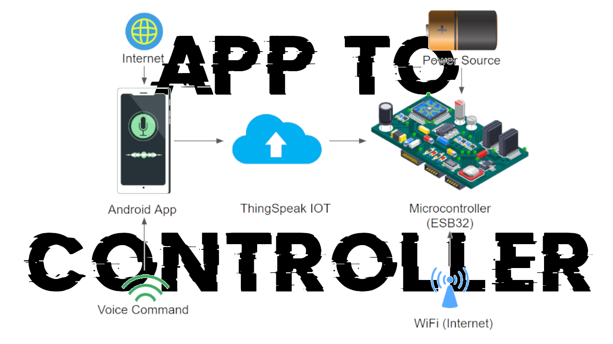

# Floor Cleaning Robot With Android Based Voice Command
The Voice-Controlled Floor Cleaning Robot with Android Application Integration introduces a novel solution for household cleaning tasks. Leveraging voice command technology and mobile connectivity, the work aims to transform floor cleaning in modern homes. Users can remotely control the robot via a dedicated Android application, eliminating manual intervention and saving time. Voice commands issued through the app are transmitted to the robot's microcontroller, enabling seamless execution of predefined functions. Equipped with sensors and navigation systems, the robot autonomously navigates, avoids obstacles, and optimizes cleaning patterns. This cutting-edge integration of voice command and mobile technology offers a streamlined and efficient solution for floor cleaning, setting new standards for smart home cleaning systems and enhancing user convenience and efficiency.

# Publication
  IEEE (Institute of Electrical and Electronics Engineers)
  https://ieeexplore.ieee.org/document/10533035

# Youtube Video

